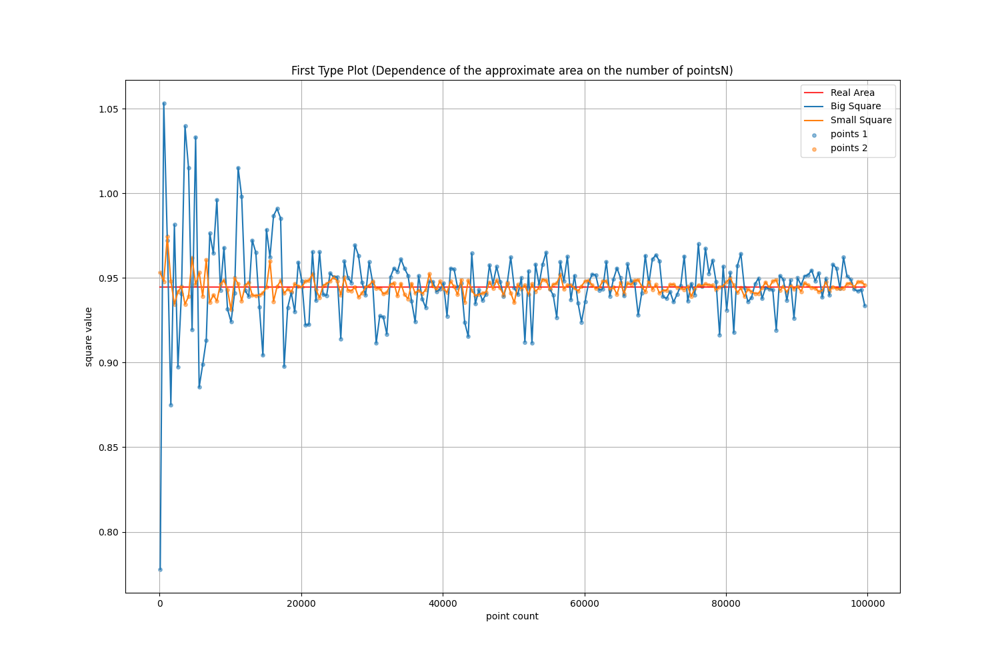
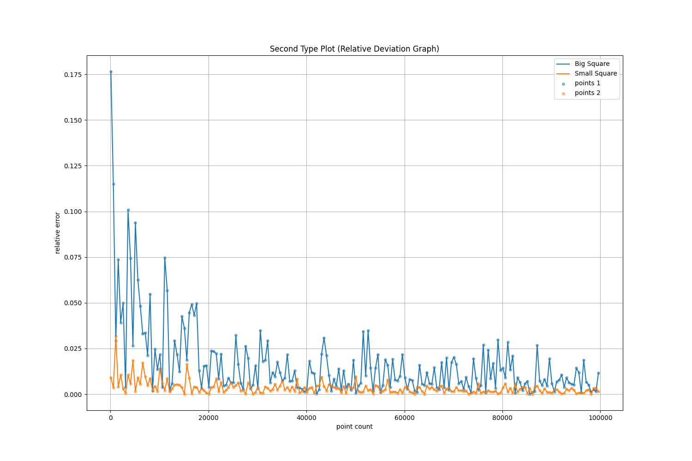

# Оценка площади пересечения кругов методом Монте-Карло

Этот проект реализует алгоритм метода Монте-Карло для приближенного вычисления площади пересечения трех заданных окружностей. Также проводится экспериментальный анализ точности метода в зависимости от параметров: размеров области генерации точек и количества точек $N$.

---
## Постановка задачи

Даны три окружности:
1. Центр: $(1, 1)$, радиус: $1$.
2. Центр: $(1.5, 2)$, радиус: $\frac{\sqrt{5}}{2}$.
3. Центр: $(2, 1.5)$, радиус: $\frac{\sqrt{5}}{2}$.

Цель:
- Приближенно вычислить площадь пересечения этих окружностей алгоритмом Монте-Карло.
- Сравнить результаты с точным значением площади:
  $S = 0.25\cdot \pi + 1.25\cdot\arcsin(0.8) - 1.$
- Построить графики
- Сделать выводы
  
---
## Файл `main.cpp` 
Алгоритм Монте-Карло для вычисления площади пересечения окружностей

**Основная логика:**
1. Заданы три окружности с конкретными центрами и радиусами.
2. Определены два квадрата для покрытия.
3. Выполняется моделирование алгоритмом Монте-Карло с увеличивающимся количеством случайных точек (от 100 до 100000 с шагом 500).
4. Результаты для обоих квадратов сохраняются в отдельные файлы.

**Описание:**

Реализован алгоритм Монте-Карло на основе случайной генерации точек в заданной прямоугольной области для приближенного вычисления площади пересечения трех кругов, заданных координатами центров и радиусами на ЯП C++. Результаты вычисляются для двух различных квадратов (широкой прямоугольной области и узкой прямоугольной области), покрывающих окружности, также вычисляется относительная ошибка по сравнению с аналитически известным точным значением площади пересечения из условия задачи.

**Основные особенности:**

1. Алгоритм Монте-Карло:  
   Генерируются случайные точки внутри заданного квадрата. Доля точек, которые находятся внутри всех трёх окружностей, используется для формирования оценки площади пересечения заданных окружностей.

2. Гибкость области покрытия:  
   Используются два квадрата из условия для анализа влияния области покрытия на точность вычислений:
   - Большой квадрат - охватывающий все окружности.
   - Маленький квадрат - плотно прилегающий к области пересечения трех окружностей.

3. Приближённая площадь и оценка относительной ошибки:

   Приблеженная площадь:  $\tilde{S} = \left(\frac{M}{N}\right) \cdot S_{\text{rec}},$
   где $M$ — количество точек внутри пересечения, $N$ — общее число точек.

   Программа вычисляет относительную ошибку относительно аналитически известного значения площади пересечения: $S = 0.25\cdot \pi + 1.25\cdot\arcsin(0.8) - 1.$
   
   
5. Запись результатов в файлы:  
   Результаты для обоих квадратов сохраняются в отдельные файлы (`big_square.txt` и `small_square.txt`), где содержатся данные о количестве точек, вычисленной площади и относительной ошибке.

   Каждая строка файла содержит:
- \( n \) — количество точек.
- \( $\tilde{S}$ \) — приближённую площадь.
- \( $\Delta$ \) — относительную ошибку:
  $\Delta = \left|\frac{\tilde{S} - S}{S}\right|.$

**Обзор кода:**

**Структуры:**
- **Point**: Представляет 2D-точку с координатами `x` и `y`.
- **Circle**: Представляет окружность, заданную центром и радиусом, реализован метод проверки нахождения точки внутри окружности.
- **Square**: Представляет квадрат, заданный двумя угловыми точками (левой нижней и правой верхней), с методом вычисления площади.
- **TestResult**: Представляет данные, которые будут записываеться в результирующие файлы.

**Основные функции:**
- **generate_point(Square)**: Генерирует случайную точку внутри квадрата методом равномерного распределения.
- **get_intersection_area(Circle, Circle, Circle, Square, int)**: Оценивает площадь пересечения трёх окружностей методом Монте-Карло.
- **write_into_file(std::string, std::vector<TestResult>)**: Записывает результаты моделирования в указанный файл.

**Используемые библиотеки**
- `<iostream>`: Для ввода/вывода в консоль.
- `<cmath>`: Для математических операций.
- `<cstdlib>`: Для общих утилит.
- `<random>`: Для генерации случайных чисел.
- `<fstream>`: Для работы с файлами.
---

## Файл `analysis.py` 

Содержит скрипт на ЯП Python для визуализации данных из файлов `big_square.txt` и `small_square.txt`, сгенерированных в `main.cpp`

Написанный код отвечает за **обработку** данных из перечисленных выше текстовых файлов и **построение** двух требуемых типов графиков: **Зависимости вычисленной площади от количества точек** и **Графика относительной ошибки**.

**Основные моменты:**

1. **Чтение данных из файлов**
   - Считываются данные из двух текстовых файлов:
     - `big_square.txt`
     - `small_square.txt`
   - Далее данные парсятся в списки `big_square_data` и `small_square_data` соответсвенно, где каждая строка файла разбивается на три значения: `n` (количество точек), `intersection_area` (оценка площади пересечения) и `relative_error` (относительная ошибка).
     
2. **Функция `build_plots`**
   - Принимает два массива данных (`big_square_data` и `small_square_data`)
   - Извлекает в массивы следущие данные:
     - `x_mas`: количество точек
     - `y1_big`, `y1_small`: оценка площади пересечения для больших и малых квадратов
     - `y2_big`, `y2_small`: относительная ошибка для больших и малых квадратов
       
3. **Построение первого типа графика:**
   - Отображаем зависимость вычисленной площади пересечения от количества точек
   - Прямая линия красного цвета представляет реальную аналитическую площадь пересечения.
   - Графики и точки визуализируют данные для больших и малых площадей покрытия.
     
4. **Построение второго типа графика:**
   - Показывает зависимость относительной ошибки от количества точек
   - Графики и точкивизуализируют данные для больших и малых площадей покрытия
  
5. **Сохраняем графики в файлы `first_type_plot.png` и `second_type_plot.png`**
   - Для сохранения графиков в файлы используются строки кода:
     ```
     plt.savefig("first_type_plot.png")
     plt.savefig("second_type_plot.png")
     ```
     соответсвенно
   - В конце строим всё командой `build_plots(big_square_data, small_square_data)`

**Таким образом данный скрипт для построения графиков помогает нам анализировать точность вычисления площади пересечения трех окружностей алгоритмом Монте-Карло при разных параметрах выборок.**
---

## Обобщим результаты

### Графики
1. **Зависимость приближенной площади от количества точек $N$:**
   - Увеличение $N$ приводит к стабилизации приближенного значения $\tilde{S}$, которое сходится к точному значению $S$.
   - Узкая прямоугольная область позволяет быстрее достичь стабильных результатов.

2. **Относительное отклонение от точной площади:**
   - Относительное отклонение 
     $\Delta = \left|\frac{\tilde{S} - S}{S}\right|$
     уменьшается с увеличением $N$.
   - Узкая область генерации точек демонстрирует меньшее отклонение при одинаковых параметрах.

---

## Выводы

После проведения экспериментов с использованием метода Монте-Карло для приближенного вычисления площади пересечения трех окружностей, можно сделать следующие выводы:

1. **Зависимость площади от количества точек:**
   - При увеличении количества случайных точек (N) приближенная площадь постепенно стабилизируется и приближается к точному значению. Это подтверждается тем, что на графике зависимости приближенной площади от числа точек (первый тип графика) приближенные значения стремятся к точной площади, с минимальными колебаниями на больших значениях N.
   - Графики показывают, что увеличение числа точек помогает улучшить точность результата, но на больших значениях точек улучшение становится менее заметным, что связано с законом больших чисел.

2. **Зависимость относительной ошибки от количества точек:**
   - График зависимости относительной ошибки (второй тип графика) демонстрирует, что ошибка уменьшается при увеличении количества точек, но остаются случайные выбросы на некоторых промежуточных значениях N.
   - При использовании более плотной области (малый квадрат) ошибка относительно точной площади оказывается ниже, чем при большем квадрате. Это подтверждает, что выбор ограниченной области для генерации точек может повысить точность результата, так как площадь, в которой происходят вычисления, становится более приближенной к искомому пересечению кругов.

3. **Влияние области генерации точек:**
   - Использование меньшей области для генерации случайных точек (малый квадрат) приводит к уменьшению относительной ошибки, так как большинство точек генерируется в пределах пересечения кругов.
   - В то время как большая область (большой квадрат) включает больше пустых пространств, что повышает вероятность ошибок и увеличивает отклонения в расчетах при меньшем количестве точек.

4. **Эффективность метода:**
   - Метод Монте-Карло оказался достаточно эффективным для приближенного вычисления площади пересечения кругов. Однако точность вычислений зависит от количества точек и размера выбранной области.
   - Для более точных результатов требуется использовать более высокое количество точек, что, однако, потенциально увеличивает время работы программы.

**В целом, метод Монте-Карло является хорошим инструментом для решения задач, где точное аналитическое решение затруднительно, однако для достижения высокой точности требуется много вычислительных ресурсов.**

---

## Приложения

### Ссылка на CodeForces
ID посылки задачи A1i: **[291486130]**

### Ссылка на репозиторий
[GitHub репозиторий с исходными данными и реализациями]([https://github.com/your-repo](https://github.com/Davonchik/Algo_HW_A1)
